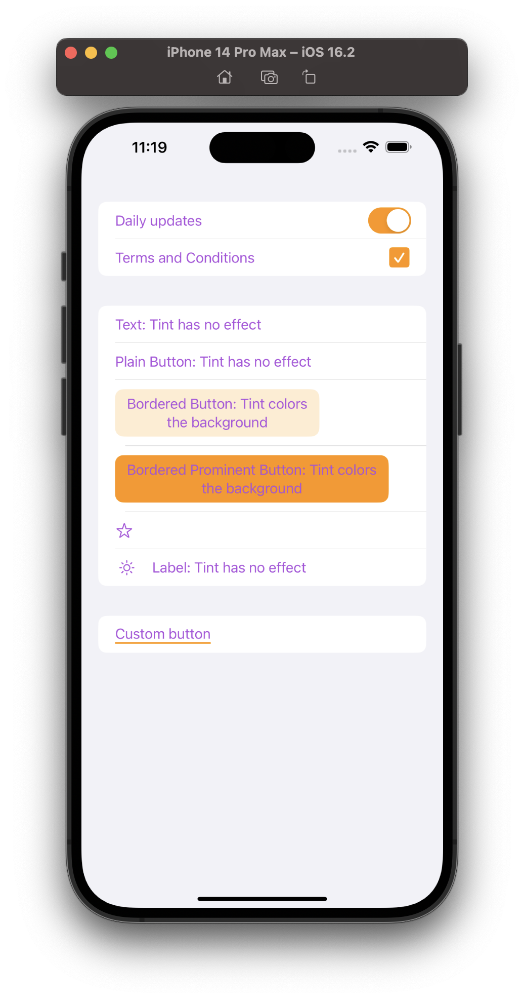

# Experiment of using foregroundStyle and tint style on different elements (iOS)

When creating a custom elements in SwiftUI, it is a good idea to utilize the tint color for them for better customization and reusability.

## Versions of used tools

- Xcode 14.2.0
- iOS 16.2
